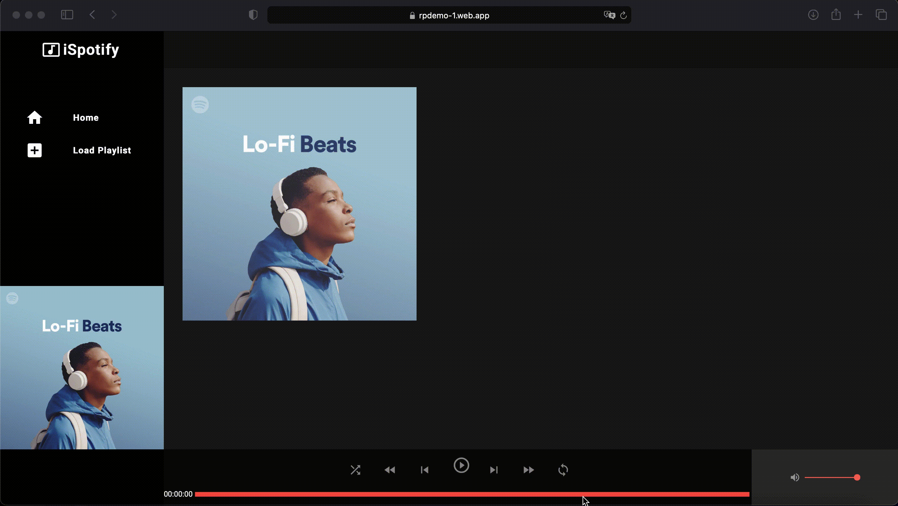

# RumblePlayer by [Rumble Studio](#https://rumble.studio)

## Player As a Service

Rumble player is an open source audio player for the web, ready to use you can seamlessly integrate into any web project.

## Existing solutions

There are few audio players out there like :

-  [Green Audio Player](#https://github.com/greghub/green-audio-player) : simple, but too simple as there is no way to add multiple song and have a playlist
   each time we want to change a song we have change its DOM attributes. very limited
-  [HTML Audio Player](#https://codepen.io/vanderzak/pen/BayjVep) : has playlist support, but require manual manipulation, don't support album art
-  [Vanilla JS Audio Player](#https://github.com/kotaid/vanilla-js-audio-player) : better than the two other since it supports playlist , album art and has an add button,
   but comes with it's own limitation : it does not expose an API for interaction, and THE UI is not customizable

All the players above also share a common problem : Very difficult and error prone if not impossible to integrate them into existing
project without breaking it. They are all designed for a very specific use case and tech stack

This lack of extensibility motivated us at Rumble Studio to build a more complete solution to address this need.
A highly customizable audio player, exposing a powerfull for more control and flexibility.

### Features

-  Seamless integration in Vanilla JS and React/Angular or any other NodeJS framework
-  Single audio file or playlist
-  Accept all audio codecs / formats
-  Support Album Art Picture
-  Playlist from podcast formatted RSS Feed
-  Auto Caching : Song are Loaded and Cached automatically
-  A Service for Managing player Across all application
-  Comprehensive API Through the player service
-  6 Default layout
-  Comprehensive API Through the player service

## Live Demo

We made this podcast loader demo to showcase the power of rumble player, just pass it the RSS Feed URL of a podcast, and it will
load the whole including episodes image



[Click here to preview the demo](#https://rpdemo-1.web.app)

# Documentation

###Quick-Start

Several options to get up and running:

-  Clone the repo: `git clone https://github.com/Rumble-Studio/rumble-player.git`
-  Install with [npm](https://www.npmjs.com/package/howler): `npm install @rumble-player/player`
-  Install with [Yarn](https://yarnpkg.com/en/package/howler): `yarn add @rumble-player/player`

## Examples Usage

###Most basic example

#### Using Vanilla JS

```html
// load the lib
<script src="https://unpkg.com/@rumble-player/player" />
<script>
	import { RumblePlayerService } from '@rumble-player/player';

	// create the service
	let player = new RumblePlayerService();

	// load a song
	player.addSong('song file uri');

	// start playing
	player.play();
</script>
```

That is it, you can play your audio tracks, subscribe to playing events

#### As a dependency using React:

in main.tsx or main.js:

```javascript
import '@rumble-player/player';
```

in your component

```typescript jsx
import { RumblePlayerService } from '@rumble-player/player';
import { useEffect } from 'react';

// Using Class Component
class MyComponent extends React.Component {
	// Player Service
	private player = new RumblePlayerService();

	componentDidMount() {
		this.player = new RumblePlayerService();
		// Load a song
		this.player.addSong('song file uri');
		// Load a song
		this.player.play();
	}
}

// Using function component

function MyComponent() {
	const player = new RumblePlayerService();
	useEffect(() => {
		player = new RumblePlayerService();
		// Load a song
		player.addSong('song file uri');
		// Load a song
		player.play();
	});
}
```

#### As a dependency using Angular:

in main.tsx:

```javascript
import '@rumble-player/player';
```

in your component class

```typescript
import { RumblePlayerService, HTMLRumblePlayer } from '@rumble-player/player';
export class PlayerComponent implements AfterViewInit {
	public player: RumblePlayerService;

	constructor() {
		this.player = new RumblePlayerService(); // instanciate player service
	}
	ngOnInit() {
		// Load a song
		this.player.addSong('song file uri');
		// Load a song
		this.player.play();
	}
}
```

###More features

this applies to both VanillaJS / Angular / React or any other JS Front Framework

##### Load from multiple type of source

```javascript
// load a playlist from multiple song uri
player.setPlaylistFromUrls(['song 1', 'song 2']);
// load a playlist from RSS FEED
player.setPLaylistFromRSSFeedURL('rss feed url');
// load playlist with song urls and image art
const playlist = [
	{
		title: 'Track 1',
		file: 'file 1 url',
		image: 'image 1 url',
	},
	{
		title: 'Track 2',
		file: 'file 2 url',
		image: 'image 2 url',
	},
];
player.setPlaylistFromObject(playlist);
```

##### Subscribe to events

Find the complete list of events and data passed in the API section below.

```javascript
// functions to be called each time an event occurs
const onPlay = (event: playerServiceEvent) => {
	const { percentage, index } = event.state;
	// Do something
};
const onPause = (event: playerServiceEvent) => {
	const { percentage, index } = event.state;
	// Do something
};

// In order to subscribe to event we will use a PlayerHTML instance
const playerHTML = new playerHTML();
playerHTML.setPlayerService(player);

// Add event listener to call each time event occurs
playerHTML.addEventListener('play', onPlay);
```

### Complete API

The Lib exposes two classes : PlayerHTNL and PlayerService.
as showed above.
Use the PlayerService in order to load audios and control it. If you also need to subscribe to the player events,
then you should also use PlayerHTML since it let's you subscribe to the player events using normal dom listeners.
All you have to do is use our predefined events name. you will find below a complete list of those events.

#### Properties

-  `autoPlayNext boolean [true]`
   if true, automatically play next song in playlist when actual song ends and loop entire playlist
-  `isPlaying : private boolean [false]`
   true if there is a song playing
-  `autoPlay : boolean [true]`
   automatically play first song on playlist load
-  `loop : boolean [false]`
   loop playing song
-  `rate : number 1`
   Playback speed, value between 0 and 4, 1 being the normal speed
-  `volume : number [1]`
   playback volume between 0 and 1.

-  **`positionUpdateCallbacks: ((position: number) => void)[]`**callback to call each time playing progress, with position in seconds
-  **`percentageUpdateCallbacks: ((percentage: number) => void)[]`**callback to call each time playing progress, with percentage played

complete list of events :

-  `play`
-  `pause`
-  `stop`
-  `next`
-  `prev`
-  `end`
-  `newPlaylist`
-  `newPosition`
-  `loaderror`
-  `playerror`

#### Methods

-  **`volume([level: number])`**: Get/Set volume level with a value between 0 and 1
-  **`index([index: number])`**: Get/set the index of playing head in playlist
-  **`playlist(): <Song>[]`**: Get the playlist
   Get more details on Song in the Interface section

-  **`percentage(): number`**: Get the percentage played of the actual playing song
-  **`position(): number`**: Get the duration played of the actual playing song
-  **`getRank(song: Song): number`**: Get the index in the playlist of the actually playing song
-  **`getSong(index: number, [instanciateHowlIfMissing = true]): Song`**: Get the song at index in the playlist. the instanciateHowlIfMissing parameter forces the loading of the song if not yet
-  **`preloadPlaylist()`**: Forces the player to load every track in the playlist
-  **`addSong(songUrl: string)`**: Add a new song in the playlist
-  **`play([index]: number): Promise<number>`**: play the song at index in the playlist, default plays the first song
-  **`pause([options: { index?: number; pauseOthers?: boolean }])`**: pauses song at index, if pauseOthers will also pause all the song in the playlist. by default it will pause everything
-  **`next()`**: play next song in the playlist , if last song it will loop and play first one
-  **`prev()`**: play previous song in the playlist if actual song has not played more than 2 seconds, otherwise will rewind to the beginning of actual playing song. if last song it will loop backward and play first one
-  **`stop([index]: number)`**: stop the song at index, otherwise will stop the actual playing

-  **`seekPerPercentage(percentage: number, [index: number])`**: seek the song at index in the playlist to percentage, by default will seek the actual playing song
-  **`seekPerPosition(position: number, [index: number])`**: seek the song at index in the playlist to position, by default will seek the actual playing song
-  **`getSongTimeLeft([index: number])`**: Get The ETA of song at index in the playlist , default will return the ETA of actual playing song
-  **`getSongTotalTime([index: number])`**: Get The total duration of song at index in the playlist , default will return the total duration of actual playing song
-  **`setPlaylistFromUrls(urls: string[])`**: Set new playlist from song urls
-  **`setPlaylistFromObject(data: any[])`**: Set new playlist from song including more details. Each element in data is an object {title: songTitle, image: imageUrl, file: songUrl}
-  **`setPLaylistFromRSSFeedURL(url: string)`**: Set new playlist from podcast formatted RSS FEED

## Custom element integration

### How to add rumble-player basic components

We create some componenents for you to illustrate how to use them.
Every component is from The GenericVisual class within src/lib/visuals.
A GenerivVisual is simply a custom HTML Element that communicate with the playerService. With such approach no need to repeat yourself setting listners callback and DOM API call to make your
UI interact with the player. most of element such are controls button or seekbar are premaid here, you can import them simply create yours making them
inherit GenericVisual and they will be able to directly interact with the player service.

Find below a list of already available Generic Visual

In buttons subfolder there are player control buttons : play/stop/pause/next/prev/forward/prev
In linear subfolder ther are the linear bar and SimpleMultilinear for Playlists

-  **`Simpleplaylist`**: Playlist Visual
-  **`SimpleImage`**: Album art picture, it also loads the picture of the playing episode from podcast playlist
-  **`SImpleTimeTotal`**: Total time of actual playing song
-  **`SImpleTimeSpent`**: played time of actual playing song
-  **`SImpleTimeLeft`**: ETA of actual playing song

To add a play button:

```typescript
import { SimplePlayButton } from '@rumble-player/player';
import { RumblePlayerService } from './playerService';
import { HTMLRumblePlayer } from './playerHTML';
// The player service
const player = new RumblePlayerService();
// the button
const play = new SimplePlayButton();
// The player UI Container
playerHTML = new HTMLRumblePlayer();
// add the button to the player UI Layout
playerHTML.setVisualChildren([play]);

// Finally set the player service to the Player front end
playerHTML.setPlayer(player);
```

you can add as much as GenericVisual you , by calling the setVisualChildren of playerHTML

### Predefined Layout configs

There are 6 predefined layout configs.
Each layout configuration defines the layout elements to show within the player

To add all components available use a config:

```typescript
playerHTML.loadConfig('configName');
```

Find below the complete list of available configurations
config1 :

-  Linear SeekBar
-  Play Button
-  Pause Button
-  Stop Button

config2 :

-  Linear SeekBar
-  Play Button
-  Pause Button
-  Forward Button
-  Rewind Button

config3 :

-  Linear SeekBar
-  Play Button
-  Pause Button
-  Next Button
-  Previous Button
-  Forward Button
-  Rewind Button

config4 :

-  Linear SeekBar
-  Play Button
-  Pause Button
-  Next Button
-  Previous Button
-  Forward Button
-  Rewind Button
-  Playlist Element

config5 :

-  Linear SeekBar
-  Play Button
-  Pause Button
-  Next Button
-  Previous Button
-  Forward Button
-  Rewind Button
-  ETA Timer
-  Progress Timer
-  Duration Timer
-  Playlist Element
-  Multi Track Linear Bar

config6 :

-  Playlist Element
-  Multi Track Linear Bar
-  Linear SeekBar
-  Image Art
-  Play Button
-  Pause Button
-  Next Button
-  Previous Button
-  Forward Button
-  Rewind Button
-  ETA Timer
-  Progress Timer
-  Duration Timer

you will find the definition of these layout configuration in src/config/config.ts

#### How to use your custom components

#####Using VanillaJS

```html
<div id="rs-player-id"></div>
// load the lib
<script src="https://unpkg.com/@rumble-player/player" />
<script>
	import { HTMLRumblePlayer, RumblePlayerService } from '@rumble-player/player';

	let container = document.getElementById('rs-player-id')
	// create the player custom element
	let player = new HTMLRumblePlayer()
	//add it to the container
	container.appendChild(player)
	// create the service
	let service = new RumblePlayerService()
	// set the service to the player
	player.setPlayer(service)
	// load a layout config
	player.loadConfig('config6')
	load a playlist
	service.setPLaylistFromRSSFeedURL('rss url')
</script>
```

#####As a dependency using React:

in main.tsx or main.js:

```javascript
import '@rumble-player/player';
```

in your component

```typescript jsx
import { RumblePlayerService, HTMLRumblePlayer } from '@rumble-player/player';

export default class MyComponent extends React.Component {
	// HTML Player container
	private containerRef = React.createRef<HTMLRumblePlayer>();

	// Player Service
	private player = new RumblePlayerService();
	// Player html custom element
	private playerHTML = new HTMLRumblePlayer();

	componentDidMount() {
		this.playerHTML = new HTMLRumblePlayer();
		this.player = new RumblePlayerService();
		// Set the service to the player
		this.playerHTML.setPlayer(this.player);
		// Load layout config number 6
		this.playerHTML.loadConfig('config6');
		// Insert the HTML player into DOM
		(this.containerRef.current as HTMLRumblePlayer).replaceWith(
			this.playerHTML
		);
		// Load playlist from RSS
		this.player.setPLaylistFromRSSFeedURL('rss feed url');
	}
	render() {
		return (
			<rumble-player
				ref={this.containerRef as React.RefObject<HTMLRumblePlayer>}
			/>
		);
	}
}
```

#####As a dependency using Angular:

in main.tsx:

```javascript
import '@rumble-player/player';
```

in app.module :

```javascript
import { CUSTOM_ELEMENTS_SCHEMA } from '@angular/core'; // add this import

@NgModule({
  declarations: [AppComponent],
  imports: [
    BrowserModule,
    RouterModule.forRoot([], { initialNavigation: 'enabled' }),
  ],
  providers: [],
  bootstrap: [AppComponent],
  schemas: [CUSTOM_ELEMENTS_SCHEMA], // ADD this line
})

```

in your template

```angular2html
<div class="playerContainer" #playerContainer>
  <rumble-player #playerHTML> </rumble-player>
</div>

```

in your component class

```typescript
import { RumblePlayerService, HTMLRumblePlayer } from '@rumble-player/player';
export class PlayerComponent implements AfterViewInit {
	public player: RumblePlayerService;

	@ViewChild('playerHTML')
	playerHTML: ElementRef<HTMLRumblePlayer> | undefined; // to access the custom element

	public eventsHistory: string[];
	public RSSLink: string;

	constructor() {
		this.player = new RumblePlayerService(); // instanciate player service
		this.RSSLink = 'rss feed url';
	}

	ngAfterViewInit() {
		// it is important to do these operation from or after ngAfterViewInit

		if (this.playerHTML) {
			// set the the audio service to the custom element
			this.playerHTML.nativeElement.setPlayer(this.player);

			// load the  predefined layout configuration  config6
			this.playerHTML.nativeElement.loadConfig('config6');

			// load playlist from RSS FEED
			this.player.setPLaylistFromRSSFeedURL(this.RSSLink);

			// or load playlist from local object
			this.player.setPlaylistFromObject(fakePlaylistWithImage);
		}
	}
}
```

### Predefined visuals

Each visual inherits from The GenericVisual class within src/lib/visuals.

You can create as much as Visual you want in order to customize and add new features to the player
Just dont forget to make it extend Generic Visual and define the it's custom element

### Interface

```typescript
interface playerState {
	position: number;
	percentage: number;
	index: number;
	playing: boolean;
}

interface playerServiceEvent {
	type: playerServiceEventType;
	state: playerState;
}
```
### Testing

When testing  you will have to be very careful  whether you want to import the library from local monorepo or from the
published npm version. in tsconfig.base.json, compilerOptions.path you will find two values :

`"@rumble-player/rp": ["libs/rumble-player/src/index.ts"],
"@rumble-player/player": ["node_modules/@rumble-player/player/src/index.ts"]`

the first one refers to the local lib and the latter to the one installed through npm

so let's say you want to import playerService, it would be :

````typescript
import { PlayerService } from '@rumble-player/rp'; // to import from local
import { PlayerService } from '@rumble-player/player'; // import from npm package
````

This is very important detail as github actions might not be able to recognize the local imports

### Known issues

Template parse errors:
'rumble-player-player' is not a known element:

1. If 'rumble-player-player' is an Angular component, then verify that it is part of this module.
2. If 'rumble-player-player' is a Web Component then add 'CUSTOM_ELEMENTS_SCHEMA' to the '@NgModule.schemas' of this component to suppress this message. ("[ERROR ->]<rumble-player-player></rumble-player-player>

https://stackoverflow.com/questions/39428132/custom-elements-schema-added-to-ngmodule-schemas-still-showing-error

if test fail to run don't showing circular JSON error message :
https://stackoverflow.com/questions/63895685/unhandledpromiserejectionwarning-typeerror-converting-circular-structure-to-js
